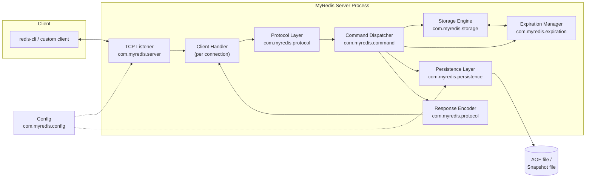
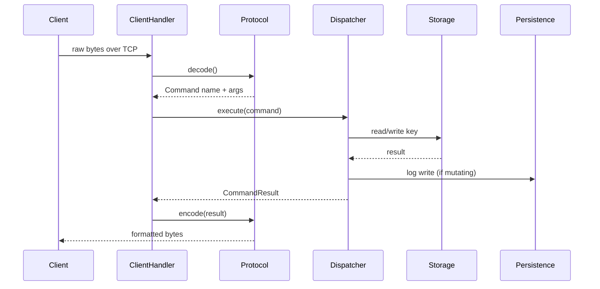

# MyRedis — Architecture

> Companion docs: [PRD.md](./PRD.md) · [Design.md](./Design.md) · [Phases.md](./Phases.md)

## 1. Purpose of this document
Describes the system-level architecture of MyRedis — how components are organized, how data flows through the system, and how the architecture evolves phase by phase. For class-level design and rationale, see **Design.md**. For the phase plan, see **Phases.md**.

## 2. High-Level Architecture

## 3. Package Responsibilities

| Package | Responsibility | Depends on |
|---|---|---|
| `server` | TCP accept loop, per-connection lifecycle, graceful shutdown | `protocol`, `command`, `config` |
| `protocol` | Wire-format encode/decode (plain-text early, RESP2 from Phase 8) | — |
| `command` | Parse decoded input into `Command` objects; dispatch to storage | `storage`, `expiration`, `persistence` |
| `storage` | In-memory key/value store, one method-family per Redis type | `expiration` |
| `expiration` | TTL bookkeeping, lazy + active expiration | — |
| `persistence` | AOF logging/replay, snapshot dump/load | `command` (for replay), `config` |
| `config` | Load and expose immutable server configuration | — |

Dependencies flow one direction only: `server → protocol → command → storage/expiration/persistence`. No lower-level package depends on a higher-level one — this is what keeps each package unit-testable in isolation.

## 4. Request Lifecycle (Sequence)

## 5. Concurrency Model (architecture view)
- One logical unit of work per client connection, scheduled onto Java 21 virtual threads (recommended — see Design.md §10) rather than one platform thread per client.
- The storage engine is the shared-state boundary: everything above it (protocol, command) is stateless per-request and needs no synchronization of its own.
- A background scheduled task (`ExpirationScheduler`) runs independently of client threads, sampling keys with a TTL.

## 6. Data Model (architecture view)
Every key maps to a `RedisObject { RedisType type; Object value; }`:

| RedisType | Backing Java structure |
|---|---|
| STRING | `java.lang.String` |
| LIST | `java.util.Deque<String>` |
| SET | `java.util.Set<String>` |
| HASH | `java.util.Map<String,String>` |
| ZSET | score-ordered structure (e.g. `ConcurrentSkipListMap` or `TreeMap` keyed by score, then member) |

Expiry is **not** stored on `RedisObject` itself — it lives in a separate `ExpirationManager` map (`key → expireAt millis`), keeping the storage and expiration concerns cleanly separated (see Design.md §7).

## 7. Networking Architecture Evolution
- **Phase 1:** blocking `java.net.ServerSocket`, single accept loop, one thread per client — simplest correct baseline.
- **Phase 4:** formalize thread-per-connection via virtual threads (or a bounded platform thread pool, to be confirmed before implementation); add graceful shutdown of all open connections.
- **Phase 8:** the protocol layer is swapped from ad hoc whitespace parsing to full RESP2 parsing **without touching the networking layer** — this is the validation that Phase 1's separation of concerns actually held.
- **Not planned by default:** an NIO/`Selector`-based single-reactor model is a documented alternative (Design.md §13), not the default path — it adds real complexity for little teaching value at this project's scale.

## 8. Persistence Architecture
- **AOF:** every mutating command is appended to an append-only log after being applied in memory; fsync policy (`ALWAYS` / `EVERY_SECOND` / `NEVER`) is configurable.
- **Snapshot:** a periodic full-keyspace dump to a versioned file, used as a fast recovery baseline.
- **Startup recovery order:** load snapshot (if present) → replay AOF written after the snapshot (if present) → else start empty.
- **Shutdown:** flush AOF buffer, optionally take a final snapshot, close the listener and all client connections, then exit.

## 9. RESP Protocol Architecture
RESP2 type prefixes: `+` simple string, `-` error, `:` integer, `$` bulk string, `*` array. Real clients send every request as a RESP array of bulk strings; MyRedis decodes that array into a command name + args and replies with whichever RESP type fits the command (e.g. `GET` → bulk string or null, `EXISTS` → integer, `PING` → simple string).

## 10. Configuration Architecture
Precedence: built-in defaults → config file (`myredis.conf`) → CLI args/env overrides. Config is loaded once at startup into an immutable `ServerConfig` and passed via constructor injection — no framework DI container.

## 11. Logging Architecture
SLF4J API + Logback backend, one logger per class.
- **INFO:** server lifecycle, client connect/disconnect.
- **DEBUG:** command execution trace.
- **WARN:** recoverable issues (malformed input, bad command).
- **ERROR:** unexpected failures.

Configured in `logback.xml`; log level overridable via config/env.

## 12. Testing & Benchmarking Architecture
- **Unit tests:** one test class per production class, mirrored under `src/test/java`.
- **Integration tests:** a real `MyRedisServer` bound to an ephemeral port, exercised over a real `Socket`.
- **Concurrency tests:** many client threads/connections against shared keys, asserting invariants (e.g. no lost updates).
- **JMH:** benchmark classes measuring GET/SET latency and throughput at varying concurrency levels.

## 13. Deployment Architecture
Multi-stage `Dockerfile`:
1. **Build stage** (e.g. `maven:3.9-eclipse-temurin-21`) compiles the JAR.
2. **Run stage** (e.g. `eclipse-temurin:21-jre-alpine`) copies only the JAR + config, exposes port `6379`, `ENTRYPOINT ["java","-jar","myredis.jar"]`.
3. Config file and data directory (for AOF/snapshots) mounted as volumes so data survives container restarts.

## 14. Architecture Decision Log
| Phase | Decision | Rationale |
|---|---|---|
| 1 | Blocking `ServerSocket`, not NIO | Simplicity first; correctness before scale |
| 4 | *(to confirm before implementing)* virtual threads over fixed thread pool | Thread-per-connection simplicity without platform-thread cost, stays within stdlib/`ExecutorService` constraints |
| 7 | *(to confirm)* AOF replay reuses the live `CommandParser`/dispatcher path | Guarantees replay semantics never drift from live semantics |

*(This table is a living log — append a row whenever a phase makes or revisits an architectural decision.)*
