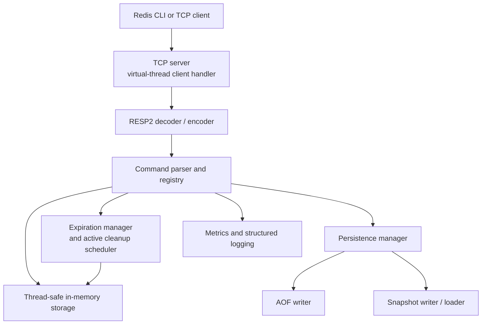

# MyRedis

<p align="center">
  <strong>A Redis-inspired in-memory database built from scratch in Java 21.</strong><br>
  Custom TCP server · RESP2 protocol · Virtual threads · AOF and snapshot persistence
</p>

<p align="center">
  <a href="https://github.com/yashrajagawane/MyRedis/actions/workflows/ci.yml"></a>
  <a href="https://github.com/yashrajagawane/MyRedis/releases"></a>
  <a href="https://github.com/yashrajagawane/MyRedis/blob/main/LICENSE"></a>
  
</p>

MyRedis is a compact, educational Redis-compatible server designed to make the
important ideas behind an in-memory database visible: wire protocols,
concurrent client handling, typed storage, expiration, persistence, recovery,
and operational limits. It has no dependency on Redis itself and does not use
Jedis, Lettuce, Spring Boot, or another Redis implementation.

> **Scope:** MyRedis is suitable for learning, local development, demonstrations,
> and controlled experiments. It is not a drop-in replacement for production
> Redis and does not claim full Redis compatibility.

## Highlights

- Java 21 with virtual-thread client handling
- Custom blocking TCP server with per-client error isolation
- RESP2 request and response support plus a convenient plain-text format
- Strings, lists, sets, hashes, and sorted sets
- Atomic signed 64-bit counters with `INCR`, `DECR`, and `INCRBY`
- Lazy and active key expiration with `EXPIRE`, `PEXPIRE`, `TTL`, and `PERSIST`
- Append-only file (AOF) and atomic snapshot persistence
- Deterministic snapshot-plus-AOF-tail recovery
- Redis-style `MULTI`, `EXEC`, and `DISCARD` transactions
- Separate Pub/Sub subsystem with bounded subscriber queues
- Optional password authentication, idle timeouts, connection limits, and
  per-client command rate limiting
- `INFO` diagnostics, structured logging, JMH benchmarks, Docker, and CI

## Quick start

### Requirements

- Java 21
- Maven 3.9+ (or the Maven wrapper, if available)
- Docker is optional
- `redis-cli` is optional and useful for protocol compatibility checks

Build and test:

```bash
mvn test
mvn package
```

Start the server:

```bash
java -jar target/myredis-0.1.0-SNAPSHOT.jar
```

The default server listens on `127.0.0.1:6379` and stores persistence files
under `data/`.

Connect with Redis CLI:

```bash
redis-cli -p 6379
```

Or use the plain-text format from a terminal:

```text
PING
SET greeting hello
GET greeting
```

Expected responses:

```text
PONG
OK
hello
```

## Example session

```text
127.0.0.1:6379> SET user:1 Yashraj EX 3600
OK
127.0.0.1:6379> GET user:1
"Yashraj"
127.0.0.1:6379> INCR visits
(integer) 1
127.0.0.1:6379> LPUSH languages Java Rust Go
(integer) 3
127.0.0.1:6379> LRANGE languages 0 -1
1) "Go"
2) "Rust"
3) "Java"
127.0.0.1:6379> TTL user:1
(integer) 3599
```

## Supported commands

MyRedis supports the following tested command subset. See the complete
[command reference](COMMANDS.md) and [compatibility notes](docs/compatibility.md)
for syntax, return values, edge cases, and intentional differences.

| Category | Commands |
| --- | --- |
| Server | `PING`, `QUIT`, `INFO`, `AUTH` |
| Transactions | `MULTI`, `EXEC`, `DISCARD` |
| Pub/Sub | `SUBSCRIBE`, `UNSUBSCRIBE`, `PUBLISH` |
| Strings | `SET`, `GET`, `DEL`, `EXISTS` |
| Counters | `INCR`, `DECR`, `INCRBY` |
| Lists | `LPUSH`, `RPUSH`, `LPOP`, `RPOP`, `LRANGE`, `LLEN` |
| Sets | `SADD`, `SREM`, `SMEMBERS`, `SISMEMBER`, `SCARD` |
| Hashes | `HSET`, `HGET`, `HDEL`, `HGETALL`, `HEXISTS` |
| Sorted sets | `ZADD`, `ZRANGE`, `ZSCORE`, `ZREM`, `ZRANK` |
| Expiration | `EXPIRE`, `PEXPIRE`, `TTL`, `PERSIST` |

## Architecture



The request path is deliberately separated:

```text
TCP networking → RESP protocol → command parsing → command execution
             → storage / expiration / persistence / metrics
```

Read the design documentation for implementation ownership and rationale:

- [Architecture](docs/architecture.md)
- [Networking](docs/networking.md)
- [Protocol](docs/protocol.md)
- [Storage engine](docs/storage-engine.md)
- [Concurrency](docs/concurrency.md)
- [Design decisions](docs/design-decisions.md)

## Data model

| Type | Internal representation | Example use |
| --- | --- | --- |
| String | `String` | Configuration, tokens, values |
| List | `ArrayDeque<String>` | Queues and ordered items |
| Set | `HashSet<String>` | Membership and uniqueness |
| Hash | `HashMap<String, String>` | Records and attributes |
| Sorted set | Score map plus ordered entries | Rankings and priority queues |

Storage is held in a concurrent keyspace. Mutable values are protected with
focused per-value locking, while command-level mutation ordering is coordinated
for persistence consistency.


## Persistence and recovery

Persistence is enabled by default:

1. Successful mutating commands are appended to the AOF.
2. Periodic or explicit snapshots write a replayable keyspace baseline.
3. Snapshot files are written through a temporary file and replaced atomically
   where the filesystem supports it.
4. Startup loads the snapshot and replays the AOF tail from the stored offset.
5. An incomplete final AOF record is treated as an interrupted write and safely
   truncated; corruption before the final record fails recovery.

The supported fsync policies are `ALWAYS`, `EVERY_SECOND`, and `NEVER`.
Persistence shutdown is idempotent and safely closes scheduled tasks and file
resources. See [persistence and recovery](docs/persistence.md) for guarantees
and limitations.

## Configuration

Configuration precedence is:

```text
built-in defaults → configuration file → MYREDIS_* environment variables → CLI flags
```

Use the checked-in [myredis.conf](myredis.conf) as a starting point:

```bash
java -jar target/myredis-0.1.0-SNAPSHOT.jar \
  --config ./myredis.conf \
  --port 6380 \
  --aof-fsync EVERY_SECOND
```

Important settings include:

| Setting | Default | Purpose |
| --- | --- | --- |
| `host` | `127.0.0.1` | Bind address |
| `port` | `6379` | TCP port; `0` is useful in tests |
| `aof.enabled` | `true` | Enable AOF and snapshots |
| `aof.fsync` | `ALWAYS` | Durability policy |
| `snapshot.interval.seconds` | `60` | Periodic snapshot interval; `0` disables it |
| `limits.max.value.bytes` | `16777216` | Maximum request value size |
| `limits.max.array.elements` | `1024` | Maximum RESP command-array size |
| `limits.max.connections` | `10000` | Maximum accepted clients |
| `auth.password` | empty | Optional password authentication |
| `limits.client.idle.timeout.seconds` | `0` | Idle timeout; `0` disables it |
| `limits.max.commands.per.second` | `0` | Per-client rate limit; `0` disables it |

All configuration is validated before startup. See the full
[configuration guide](docs/configuration.md).

## Docker

Build and run with persistent storage:

```bash
docker build -t myredis .
docker run --rm \
  --name myredis \
  -p 6379:6379 \
  -e MYREDIS_AUTH_PASSWORD=change-me \
  -v myredis-data:/app/data \
  myredis
```

Connect to the container:

```bash
redis-cli -p 6379 -a change-me
```

The image uses a non-root `myredis` user, container-aware JVM settings, a
health check, a configurable port, `/app/data` for persistence, and SIGTERM
handling. Do not expose an unauthenticated instance directly to the public
internet. See [security guidance](docs/security.md).

## Testing and verification

Run the normal verification commands:

```bash
mvn test          # unit, protocol, integration, persistence, and load tests
mvn package       # compile and build the shaded executable JAR
mvn test-compile  # compile benchmark classes
```

The test suite covers storage types, wrong-type errors, numeric overflow,
expiration, RESP2 framing, malformed input, partial reads, pipelining,
transactions, Pub/Sub, concurrent clients, connection limits, persistence
recovery, corrupted files, configuration validation, and graceful shutdown.

JMH benchmark sources live under `src/test/java/com/myredis/benchmark`. They
are intentionally separate from the default test suite. See
[testing](docs/testing.md) and [benchmarking](docs/benchmarking.md) for the
methodology and current limitations.

## Observability

Use the `INFO` command to inspect operational counters, including connected
clients, command counts, command latency percentiles, expirations, AOF writes,
snapshots, and persistence errors. Structured logging is configured through
`logback.xml` and the `log.level` setting.

See [observability documentation](docs/observability.md) for the current
metrics and their interpretation.

## Project structure

```text
MyRedis/
├── src/main/java/com/myredis/
│   ├── command/          Command definitions, parser, registry, transactions
│   ├── config/           Defaults, file/env/CLI configuration and validation
│   ├── expiration/       TTL bookkeeping and active cleanup
│   ├── observability/    Metrics and diagnostics
│   ├── persistence/      AOF, snapshots, recovery, fsync policies
│   ├── protocol/         RESP2 decoder, encoder, and limits
│   ├── server/            TCP server, client lifecycle, Pub/Sub, connections
│   └── storage/           Concurrent in-memory typed storage
├── src/test/java/         Unit, integration, persistence, load, and benchmark tests
├── docs/                  Architecture, operations, protocol, and design guides
├── .github/workflows/     GitHub Actions CI
├── Dockerfile             Container image definition
├── myredis.conf           Local configuration
├── docker-myredis.conf    Container configuration
├── COMMANDS.md            Command reference
└── pom.xml                Maven build and quality configuration
```

## Compatibility

MyRedis implements a tested RESP2-compatible subset, not the complete Redis
command surface. It supports Redis CLI-style command arrays, plain-text
commands, null values, arrays, errors, pipelining, and partial TCP reads.

Not implemented: full Redis command/options compatibility, ACLs, TLS,
replication, clustering, encrypted persistence, and multi-tenant isolation.
Consult the [compatibility matrix](docs/compatibility.md) before depending on
Redis-specific behavior.

## Security boundaries

The default local configuration binds to loopback. Docker intentionally uses a
container-specific configuration that binds to `0.0.0.0` for published ports.
Use authentication, firewall rules, private networking, and restricted volume
permissions before exposing a container beyond a trusted network. Password
authentication is plaintext without TLS and is therefore not sufficient for an
untrusted network.

See [security.md](docs/security.md) for current protections and limitations.

## Roadmap

Potential future work includes:

- Broader automated Redis client compatibility testing
- Memory quotas and eviction policies
- TLS and stronger authentication/ACL support
- More failure-injection and long-running soak tests
- Memory profiling and reproducible network benchmarks
- Replication and clustering experiments

These items are intentionally separate from the current stable implementation.

## Contributing

Contributions should preserve the project boundaries between networking,
protocol, commands, storage, expiration, persistence, and observability.
Please include focused tests for behavior changes, update documentation when
commands or configuration change, and run `mvn test` before opening a pull
request.

## License

MyRedis is released under the [MIT License](LICENSE).
