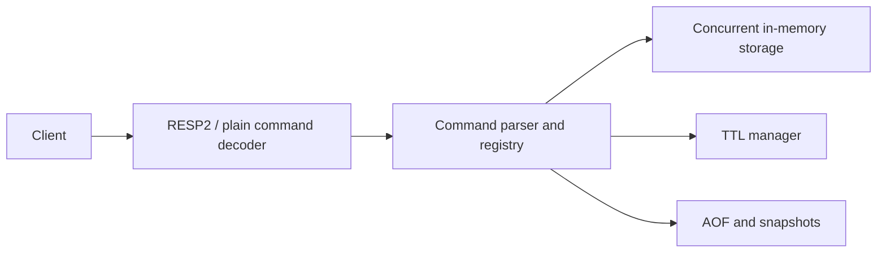

# MyRedis

MyRedis is a learning-first Redis-inspired in-memory database built from scratch in Java 21. It supports strings, lists, sets, hashes, sorted sets, expiration, AOF/snapshot persistence, RESP2, concurrent clients, and JMH benchmarks.

Every push and pull request runs the Maven test suite, builds the shaded JAR, and verifies the Docker image through [GitHub Actions](.github/workflows/ci.yml).

## Quick start

```bash
mvn test
mvn package
java -jar target/myredis-0.1.0-SNAPSHOT.jar
```

The server listens on `0.0.0.0:6379` and stores persistence data under `data/`. Use `redis-cli -p 6379` or send plain commands such as `SET key value` and `GET key`.

## Supported commands

Commands are available through RESP2 and the plain-text request format.

| Area | Commands |
| --- | --- |
| Server | `PING` |
| Strings | `SET`, `GET`, `DEL`, `EXISTS` |
| Atomic counters | `INCR`, `DECR`, `INCRBY` |
| Lists | `LPUSH`, `RPUSH`, `LPOP`, `RPOP`, `LRANGE`, `LLEN` |
| Sets | `SADD`, `SREM`, `SMEMBERS`, `SISMEMBER`, `SCARD` |
| Hashes | `HSET`, `HGET`, `HDEL`, `HGETALL`, `HEXISTS` |
| Sorted sets | `ZADD`, `ZRANGE`, `ZSCORE`, `ZREM`, `ZRANK` |
| Expiration | `EXPIRE`, `TTL`, `PERSIST` |

`SET` supports `EX` and `PX` options. Numeric commands operate on signed 64-bit integers and reject non-numeric values and overflow. Commands are persisted only after successful mutation.

## Data types and persistence

MyRedis stores strings, lists, sets, hashes, and sorted sets in memory. Expiration is enforced lazily on access and by an active cleanup scheduler. When enabled, the append-only file records successful mutations and snapshots provide a restart baseline; recovery loads the snapshot and replays the AOF tail.

## Limits and safety

The RESP decoder enforces maximum bulk-value and array sizes. `limits.max.connections` bounds accepted client sockets so connection growth cannot create unlimited handler tasks. Invalid configuration values fail fast with an actionable error.

## Configuration

Runtime defaults are in [myredis.conf](myredis.conf). Configuration is applied in this order: defaults, `myredis.conf` (or `--config path`), `MYREDIS_*` environment variables, then CLI flags.

```bash
java -jar target/myredis-0.1.0-SNAPSHOT.jar --port 6380 --aof-fsync EVERY_SECOND
```

Supported settings include `host`, `port`, `aof.enabled`, `aof.path`, `aof.fsync`, `snapshot.path`, `snapshot.interval.seconds`, `log.level`, `limits.max.value.bytes`, `limits.max.array.elements`, and `limits.max.connections`.

## Docker

```bash
docker build -t myredis .
docker run --rm -p 6379:6379 -v myredis-data:/app/data myredis
```

## Testing

```bash
mvn test
mvn package
```

The test suite covers storage types, expiration, RESP2 decoding/encoding, concurrent clients, persistence recovery, malformed input, configuration validation, and connection limits.

## Architecture



See [Architecture.md](Architecture.md), [Design.md](Design.md), [PRD.md](PRD.md), and [Phases.md](Phases.md) for detailed requirements and design decisions. Benchmark results are documented in [BENCHMARKS.md](BENCHMARKS.md).
