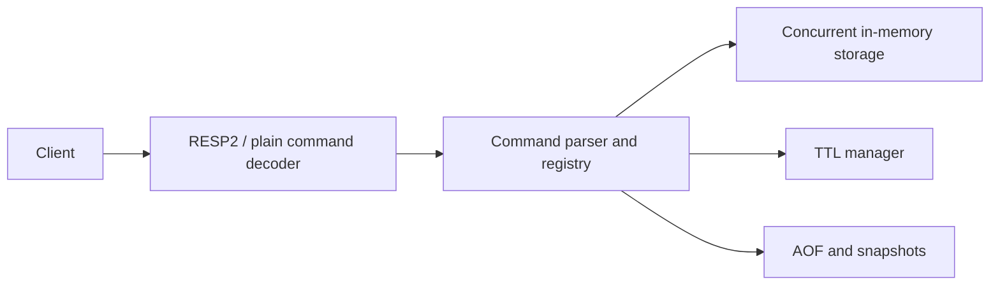

# MyRedis

MyRedis is a learning-first Redis-inspired in-memory database built from scratch in Java 21. It supports strings, lists, sets, hashes, sorted sets, expiration, AOF/snapshot persistence, RESP2, concurrent clients, and JMH benchmarks.

Every push and pull request runs the Maven test suite, builds the shaded JAR, and verifies the Docker image through [GitHub Actions](.github/workflows/ci.yml).

## Quick start

```bash
mvn test
mvn package
java -jar target/myredis-0.1.0-SNAPSHOT.jar
```

The server listens on `0.0.0.0:6379` and stores persistence data under `data/`. Use `redis-cli -p 6379` or send plain commands such as `SET key value` and `GET key`.

## Configuration

Runtime defaults are in [myredis.conf](myredis.conf). Configuration is applied in this order: defaults, `myredis.conf` (or `--config path`), `MYREDIS_*` environment variables, then CLI flags.

```bash
java -jar target/myredis-0.1.0-SNAPSHOT.jar --port 6380 --aof-fsync EVERY_SECOND
```

Supported settings include `host`, `port`, `aof.enabled`, `aof.path`, `aof.fsync`, `snapshot.path`, `snapshot.interval.seconds`, `log.level`, `limits.max.value.bytes`, `limits.max.array.elements`, and `limits.max.connections`.

## Docker

```bash
docker build -t myredis .
docker run --rm -p 6379:6379 -v myredis-data:/app/data myredis
```

## Architecture



See [Architecture.md](Architecture.md), [Design.md](Design.md), [PRD.md](PRD.md), and [Phases.md](Phases.md) for detailed requirements and design decisions. Benchmark results are documented in [BENCHMARKS.md](BENCHMARKS.md).
