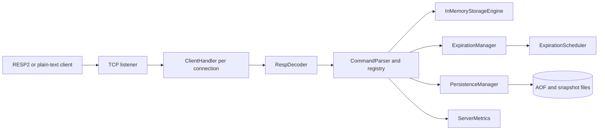

# Architecture

This document describes the implementation currently on `main`. The original
design notes in [Architecture.md](../Architecture.md) remain useful historical
context; this guide focuses on the code that is actually running today.

## System boundary



The normal request path is:

1. `MyRedisServer` accepts a socket and registers the client.
2. `ClientHandler` reads one RESP2 array or plain-text command at a time.
3. `RespDecoder` enforces configured bulk-value and array-size limits.
4. `CommandParser` resolves the command and creates a `CommandContext`.
5. The command operates on storage and expiration state.
6. Successful mutations are appended to the AOF while holding the mutation lock.
7. `RespEncoder` or the plain-text response path sends the result.

## Package ownership

| Package | Owns | Important boundary |
| --- | --- | --- |
| `server` | TCP accept loop, client lifecycle, shutdown | Does not implement command semantics |
| `protocol` | RESP2 decoding/encoding and protocol errors | Does not access storage |
| `command` | Command lookup, argument validation, execution | Coordinates storage, expiry, persistence, and metrics |
| `storage` | Typed in-memory values and atomic key operations | Uses `ExpirationManager` for expiry checks |
| `expiration` | Expiry timestamps, lazy expiry, active cleanup | Does not own value objects |
| `persistence` | AOF append/replay and atomic snapshots | Reuses command execution for recovery |
| `config` | Precedence, parsing, and validation | Produces immutable `ServerConfig` |
| `observability` | Process-local counters exposed by `INFO` | Does not affect command results |

## Concurrency

Each accepted connection runs on a Java 21 virtual thread. The shared storage
uses concurrent maps, while individual mutable collection values are protected
by their storage operations. Persistence mutations are serialized by a fair
`ReentrantLock`; this keeps the in-memory mutation and its corresponding AOF
append ordered.

Expiration cleanup runs on a scheduled executor. Lazy access and active cleanup
use conditional removal so a stale expiry cannot delete a newer value.

## Persistence and recovery

The persistence sequence is:

```text
successful mutation -> AOF append
periodic/shutdown snapshot -> temporary file -> fsync -> atomic replacement
startup -> snapshot load -> validate AOF offset -> replay AOF tail
```

Snapshots store the AOF offset used to create them and preserve remaining TTLs
with `PEXPIRE` commands. Incomplete final AOF records are truncated during
recovery; corruption before the final record fails recovery rather than being
silently ignored.

## Configuration and limits

Configuration precedence is defaults, configuration file, environment
variables, then CLI arguments. Current request/resource limits include maximum
bulk/plain value size, maximum RESP array elements, and maximum client
connections. Invalid values fail during startup validation.

## Deliberate scope boundaries

The current architecture does not implement Redis transactions, Pub/Sub,
authentication, clustering, replication, or full Redis command compatibility.
Those are separate design decisions, not implicit promises of this project.
